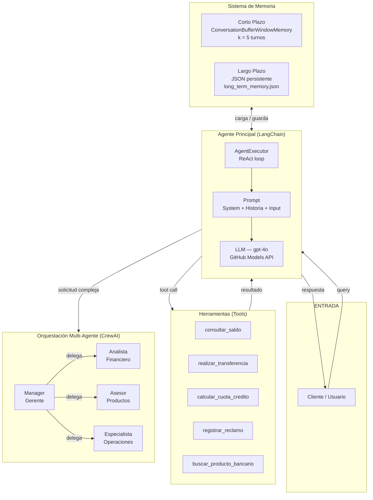
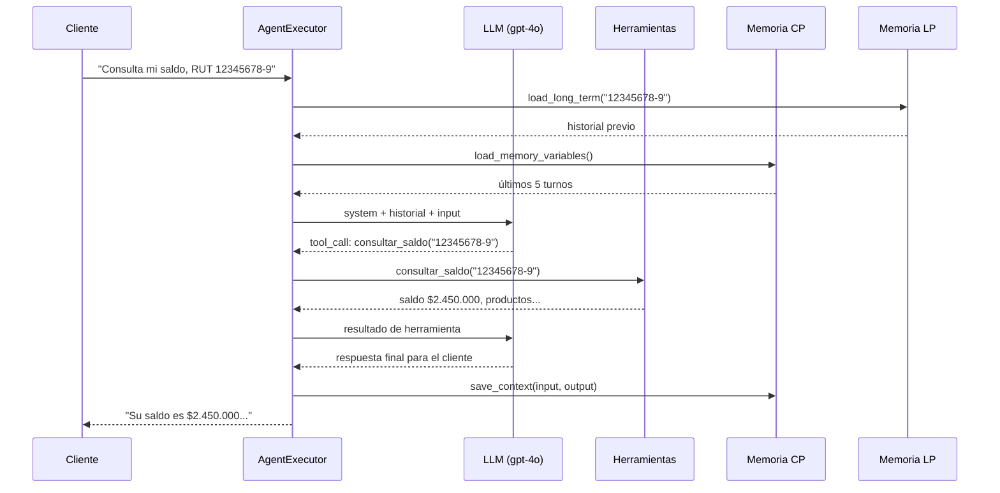
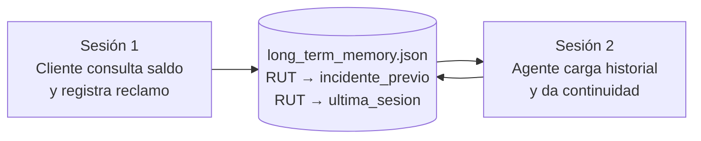
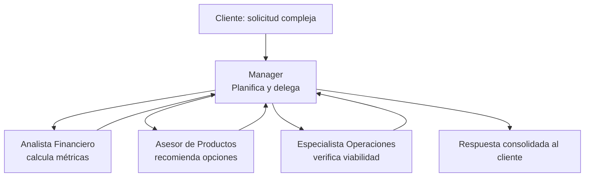

# EP2 — Agente Funcional: Banco Digital Chile

**ISY0101 · Ingeniería de Soluciones con IA · Evaluación Parcial N°2**

Implementación de un agente bancario conversacional que extiende el chatbot del EP1
con herramientas de consulta/escritura/razonamiento, memoria de corto y largo plazo,
planificación multi-etapa y orquestación de múltiples agentes especializados.

---

## Tabla de Contenidos

1. [Descripción del Problema](#1-descripción-del-problema)
2. [Arquitectura General](#2-arquitectura-general)
3. [Componentes del Sistema](#3-componentes-del-sistema)
4. [Flujos de Trabajo](#4-flujos-de-trabajo)
5. [Instalación y Configuración](#5-instalación-y-configuración)
6. [Cómo Ejecutar](#6-cómo-ejecutar)
7. [Escenarios de Prueba](#7-escenarios-de-prueba)
8. [Decisiones de Diseño](#8-decisiones-de-diseño)
9. [Referencias](#9-referencias)

---

## 1. Descripción del Problema

El EP1 construyó un chatbot bancario básico capaz de responder preguntas sobre
productos del Banco Digital Chile. Sin embargo, presentaba tres limitaciones:

| Limitación EP1 | Solución EP2 |
|---|---|
| Sin estado (stateless) — olvida entre turnos | Memoria a corto plazo (ConversationBufferWindowMemory) |
| Sin persistencia — olvida entre sesiones | Memoria a largo plazo (JSON persistente) |
| Solo responde preguntas | Ejecuta acciones: transfiere, registra reclamos, calcula |
| Un solo modelo LLM | Equipo de agentes especializados (CrewAI) |

El agente resultante puede gestionar tareas bancarias end-to-end:
consulta de saldo, transferencias, simulación de créditos, registro de reclamos
e información de productos.

---

## 2. Arquitectura General



---

## 3. Componentes del Sistema

### 3.1 Herramientas (`agent/tools.py`)

| Herramienta | Tipo | Descripción |
|---|---|---|
| `consultar_saldo` | Consulta | Retorna saldo, tipo de cuenta y productos activos dado un RUT |
| `realizar_transferencia` | Escritura | Ejecuta transferencias entre cuentas validando saldo |
| `calcular_cuota_credito` | Razonamiento | Aplica fórmula de amortización francesa para simular créditos |
| `registrar_reclamo` | Escritura | Genera ticket de reclamo y persiste en `reclamos.json` |
| `buscar_producto_bancario` | Consulta | Retorna características y requisitos de productos bancarios |

Cada herramienta usa el decorador `@tool` de LangChain, lo que la convierte
automáticamente en un objeto compatible con `AgentExecutor`.

### 3.2 Sistema de Memoria (`agent/memory.py`)

**Memoria a Corto Plazo**

Implementada con `ConversationBufferWindowMemory(k=5)`. Mantiene los últimos
5 pares usuario/asistente como lista de mensajes. El patrón de uso es:

```python
historial = memory.load_memory_variables({})["chat_history"]
respuesta = executor.invoke({"input": query, "chat_history": historial})
memory.save_context({"input": query}, {"output": respuesta["output"]})
```

**Memoria a Largo Plazo**

Persiste información del cliente en `long_term_memory.json` con estructura:

```json
{
  "12345678-9": {
    "ultima_sesion": {"valor": "2025-05-19", "timestamp": "2025-05-19T10:30:00"},
    "incidente_previo": {"valor": "Cobro duplicado — resuelto RC20241112", "timestamp": "..."}
  }
}
```

Al inicio de cada sesión, si se proporciona el RUT del cliente, el sistema
carga este contexto e inyecta el historial en el system prompt.

| Tipo | Clase | Caso de uso óptimo |
|---|---|---|
| Buffer completo | `ConversationBufferMemory` | Sesiones cortas, todos los detalles importan |
| Ventana (k=5) | `ConversationBufferWindowMemory` | Chatbots de servicio — contexto reciente |
| Resumen | `ConversationSummaryMemory` | Sesiones largas — ahorro de tokens |
| JSON persistente | Implementación propia | Continuidad entre sesiones (largo plazo) |

### 3.3 Planificación (`demos/demo_planning.py`)

El agente utiliza el patrón **Plan-and-Execute** para solicitudes multi-etapa.
A diferencia del ReAct puro (que decide la siguiente acción reactivamente),
este patrón instruye al LLM a generar un plan completo antes de actuar:

```
Plan: 1) consultar saldo del cliente → 2) calcular cuota a 20 años → 
      3) calcular cuota a 15 años → 4) comparar y presentar requisitos
```

Ventajas respecto al ReAct puro:
- Menos riesgo de perder el objetivo en tareas largas
- Permite comparar resultados de pasos anteriores
- El agente puede adaptar pasos restantes si un resultado cambia las condiciones

### 3.4 Orquestación Multi-Agente (`orchestration/crew_orchestration.py`)

Implementa dos estrategias de CrewAI:

**Secuencial** (`Process.sequential`): flujo fijo
```
Analista → Asesor → Operaciones → Manager
```
Cada agente recibe como contexto el output del anterior.

**Jerárquico** (`Process.hierarchical`): manager como orquestador dinámico
El Manager decide en tiempo real qué especialista activar y en qué orden,
lo que permite replanificación si un agente devuelve un resultado inesperado.

---

## 4. Flujos de Trabajo

### 4.1 Flujo Completo del Agente Principal



### 4.2 Flujo de Memoria entre Sesiones



### 4.3 Flujo de Orquestación Jerárquica



---

## 5. Instalación y Configuración

### 5.1 Requisitos

- Python 3.10+
- Cuenta en GitHub con acceso a GitHub Models (`gpt-4o`)

### 5.2 Instalación

```bash
# 1. Clonar el repositorio
git clone https://github.com/rogrosas/Ingenier-a-de-Soluciones-con-Inteligencia-Artificial
cd EP2

# 2. Crear entorno virtual
python -m venv .venv
.venv\Scripts\activate          # Windows
# source .venv/bin/activate     # Linux / macOS

# 3. Instalar dependencias
pip install -r requirements.txt

# 4. Configurar variables de entorno
copy .env.example .env
# Editar .env con tu GITHUB_TOKEN
```

### 5.3 Variables de Entorno

| Variable | Descripción |
|---|---|
| `GITHUB_BASE_URL` | `https://models.inference.ai.azure.com` |
| `GITHUB_TOKEN` | Token personal de GitHub con acceso a Models |

---

## 6. Cómo Ejecutar

### Agente Interactivo

```bash
# Sesión anónima
python agent/agent.py

# Sesión con RUT (carga memoria de largo plazo)
python agent/agent.py --rut 12345678-9
```

### Demo de 4 Escenarios

```bash
# Todos los escenarios
python demos/demo_agent.py

# Un escenario específico
python demos/demo_agent.py --escenario 2
```

### Demo de Planificación y Multi-Agente

```bash
python demos/demo_planning.py
python demos/demo_planning.py --modo planning
python demos/demo_planning.py --modo multiagente
```

### Orquestación CrewAI directa

```bash
python orchestration/crew_orchestration.py
python orchestration/crew_orchestration.py --modo jerarquico
```

---

## 7. Escenarios de Prueba

| Escenario | Qué valida | IE |
|---|---|---|
| 1 — Consulta + memoria CP | El agente recuerda el saldo sin re-consultar | IE1, IE3 |
| 2 — Crédito multi-etapa | Planifica info → cálculo a 24m → cálculo a 36m → requisitos | IE5, IE6 |
| 3 — Reclamo con memoria LP | Recupera historial de sesión anterior | IE3, IE4 |
| 4 — Transferencia adaptativa | Detecta saldo insuficiente y propone alternativas | IE6 |
| 5 — Plan-and-Execute | Genera plan explícito antes de usar herramientas | IE5 |
| 6 — Multi-agente CrewAI | 4 agentes especializados resuelven solicitud compleja | IE2, IE5 |

**RUTs de prueba disponibles:**

| RUT | Nombre | Saldo | Tipo |
|---|---|---|---|
| `12345678-9` | María González | $2.450.000 | Cuenta Corriente |
| `98765432-1` | Carlos Pérez | $850.000 | Cuenta Vista |
| `11223344-5` | Ana Torres | $5.200.000 | Cuenta Ahorro |

---

## 8. Decisiones de Diseño

**¿Por qué LangChain para el agente principal?**
LangChain ofrece el ciclo ReAct a través de `AgentExecutor`, gestión automática
de herramientas via `@tool`, y múltiples tipos de memoria compatibles entre sí.
Para un agente individual con estado conversacional, es más directo que CrewAI.

**¿Por qué CrewAI para la orquestación?**
CrewAI introduce la abstracción de "equipo con roles", lo que permite separar
responsabilidades (analista, asesor, operaciones) y escalar el sistema agregando
nuevos agentes sin modificar los existentes. El proceso jerárquico agrega
replanificación dinámica que el proceso secuencial no ofrece.

**¿Por qué `ConversationBufferWindowMemory(k=5)` como default?**
Equilibrio entre contexto útil y costo de tokens. Una ventana de 5 turnos
cubre la mayoría de las secuencias bancarias (identificación → consulta →
operación → confirmación → cierre) sin exceder los límites del contexto.

**¿Por qué JSON para la memoria a largo plazo?**
No requiere infraestructura adicional (base de datos, vector store), lo que
facilita la evaluación y el despliegue rápido. En producción se reemplazaría
por Redis o una base de datos relacional.

---

## 9. Referencias

Chase, H. (2023). *LangChain: Building applications with LLMs through composability* [Framework]. LangChain. https://www.langchain.com/agents

Moura, J. (2024). *CrewAI: Framework for orchestrating role-playing, autonomous AI agents* [Framework]. CrewAI. https://docs.crewai.com/en/introduction

OpenAI. (2024). *Function calling*. OpenAI Platform Documentation. https://platform.openai.com/docs/guides/function-calling

Yao, S., Zhao, J., Yu, D., Du, N., Shafran, I., Narasimhan, K., & Cao, Y. (2022). *ReAct: Synergizing reasoning and acting in language models*. arXiv. https://arxiv.org/abs/2210.03629

LangChain. (2024). *Conceptual guide: Memory*. Python LangChain Documentation. https://python.langchain.com/docs/modules/memory/

---

*EP2 · ISY0101 · Ingeniería de Soluciones con IA · 2025*
